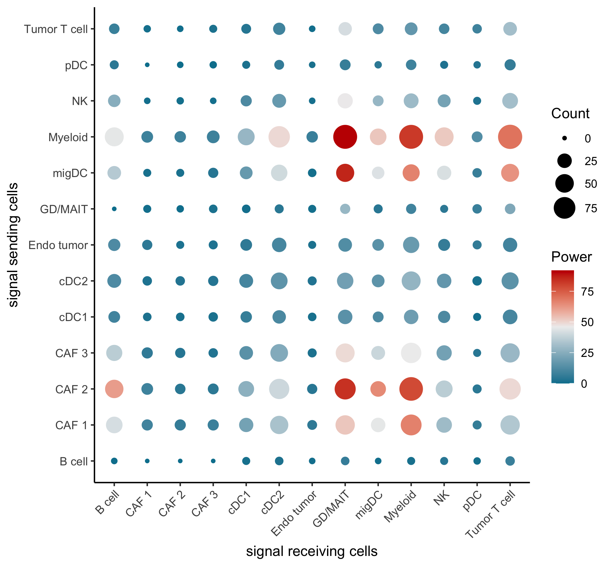

# Running InterCellDB step-by-step
## Installation

The installation steps given as follows:

1. remove the 'GO.db' package 

```R
remove.packages("GO.db")
```

2. install the required packages and re-intall 'GO.db' package from Bioconductor

```R
install.packages("devtools")
install.packages("BiocManager")
BiocManager::install(pkgs = "GO.db")
```

3. install the InterCellDB package from GitHub

```R
devtools::install_github("ZJUDBlab/InterCellDB")
```


## Running Process


This tutorial illustrates the steps for one routine process using InterCellDB. The main function and features provided by InterCellDB are shown by using the example of the scRNA-seq data from mouse melanoma and lymph node (original article [PMID: 32433953](https://pubmed.ncbi.nlm.nih.gov/32433953/)).

Required libraries for running this tutorial is provided as follows:

```R
# versions of used packages when we tested the code are given
library(InterCellDB)  # 0.9.2
library(Seurat)       # 3.2.0
library(dplyr)        # 1.0.5
library(future)       # 1.21.0
```


## Step 1: Data preparation and create InterCell object

InterCellDB requires 2 data as input:

- normalized count matrix
- differentially expressed genes (DEGs) with their belonging clusters

We provide one pre-processed Seurat object in RDS file to illustrate the data format of the normalized count matrix, and it can be downloaded in [TODO links]. 

```R
seurat.obj <- readRDS(#[TODO])
tmp.counts <- seurat.obj[["RNA"]]@data
colnames(tmp.counts) <- as.character(Idents(seurat.obj))
# show data structure, row names are genes, column names are clusters
tmp.counts[1:5, 1:5]
# 5 x 5 sparse Matrix of class "dgCMatrix"
#            cDC2        NK        NK       cDC2   Myeloid
# Gnai3 .         1.4526836 0.7893417 0.02189368 .        
# Cdc45 0.1342404 0.1345867 .         1.01913912 0.1698247
# Scml2 .         .         .         .          .        
# Apoh  .         .         .         .          .        
# Narf  .         .         .         0.02189368 .
```

If users are attempting to use their own dataset, make sure the data normalization and cell clustering are done. Take Seurat for example, the `NormalizeData`  or `SCTransform` should be processed for getting normalizd data, and `FindClusters` should be processed for getting cell clustering result. User-defined clustering is also allowed, and users should carefully follow the data format given above to set the clusters in right place.


For DEGs, we also provide the example data in [TODO links].

```R
readRDS([TODO links])
```

To note, InterCellDB defines several mandatory column names when read in DEGs, which are columns named 'gene', 'cluster', 'LogFC', 'PVal', and their meanings are listed below:

- Column 'gene', the gene name.
- Column 'cluster', the belonging cluster of every DEG.
- Column 'LogFC', the log fold changes of each DEG.
- Column 'PVal', the statistical significance for the gene being defined as DEG.


Then, the `InterCell` object is created and we name it here as `inter.obj`. This variable is used for doing all the following analysis.
```R
inter.obj <- CreateInterCellObject(markers.used, species = "mouse", add.exprs = TRUE, exprs.data = tmp.counts)
```


## Step 2: Customize interactions and proteins from databases

InterCellDB provides customized settings in selecting interactions and proteins.

For customizing interactions, InterCellDB provides 4 options: evidence source, credibility score, action mode and action effect. To run this example data, we use all experimentally validated interactions, pathway-curated interactions and predicted interactions, and select those physically associated ones.

```R
inter.obj <- SelectDBSubset(inter.obj,
		use.exp = TRUE,   # to use experimentally validated interactions
		exp.score.range = c(1, 1000),  # use all credibility score for 'use.exp'
		use.know = TRUE,  # to use pathway curated interactions
		know.score.range = c(1, 1000),  # use all credibility score for 'use.know'
		use.pred = TRUE,  # to use predicted interactions
		pred.score.range = c(1, 1000),  # use all credibility score for 'use.pred' 
		sel.action.mode = "binding",  # select physically associated ones
		sel.action.effect = "ALL")    # not limiting action effects
```


Details about 4 options on customizing interaction database are given in the supplementary information of the article. Here, we list some of the most commonly used options.

- evidence sources: experimentally validatd (`use.exp`), pathway curated (`use.know`), predicted (`use.pred`).
- credibility score: ranging from 1 to 1000. Highest confidence should >= 900, and high confidence should > 700, and medium > 400, while low <= 400.
- action mode: giving the relation of interacting proteins. Commonly used one is 'binding', which selects physically associated protein interactions.
- action effect: giving the effect of protein interaction. Commonly used ones are 'positive' and 'negative'. 'positive' means one protein promotes the expression of the other, while 'negative' means the inhibition of the other.


For customizing included proteins, InterCellDB also provides 4 options: protein expression change, protein subcellular location, function and relevant biological process. Here, we select 2 subsets of proteins using InterCellDB on the latter 3 options and fetch their corresponding gene symbols. One subset is the genes for signal receiving cells (denoted as `genes.receiver` below) and the other for signal sending cells (denoted as `genes.sender` below).

```R
# fetch genes of interest
genes.receiver <- FetchGeneOI(inter.obj, 
		sel.location = "Plasma Membrane",  # fetch proteins located in plasma membrane
		sel.location.score = c(4:5),       # 4 and 5 are of high confidence
		sel.type = "Receptor",             # fetch those receptors
		sel.go.terms = "GO:0006955"        # fetch [GO:0006955]immune response related proteins
		)
# [1] "Fetch 160 genes of interest."
genes.sender <- FetchGeneOI(inter.obj, 
		sel.location = "Extracellular Region",  # fetch proteins located in extracellular region
		sel.location.score = c(4:5),            # 4 and 5 are of high confidence
		sel.go.terms = "GO:0006955"             # fetch [GO:0006955]immune response related proteins
		)
# [1] "Fetch 281 genes of interest."
```

To note, as the protein expression change is highly associated with the input data, InterCellDB put it to be done in later steps, see parameter `sel.exprs.change` in  `AnalyzeInterInFullView`. If users want to explore more selections on the other 3 options, InterCellDB provides several functions to list all items for them.

- protein subcellular location: `ListAllGeneLocation`
- protein function: `ListAllGeneType` and `ListAllGeneMergeType`
- protein involved biological process: `ListAllGeneGOTerm`


## Step 3: Perform full network analysis

Full network analysis summarises the interactions between every 2 cell clusters, and infers main participants by aggragated power and total count of gene pairs. The power of every gene pair is calculated by the product of expressions of 2 participating genes. The selected gene pairs are those with p-value < 0.05 in cell label permutation test (the p-value cutoff can also be set by users).

Full network analysis goes with 2 steps:

1. generate cell label permutation list
2. network analysis and filter statistically significant gene pairs

Here, we do cell label permutation on normalized count matrix for 100 times with 2 parallel processes. During every time of permutation, the average gene expressions for each gene and for every cell cluster are re-calculated. 

```R
plan("multiprocess", workers = 2)  # package future provides the parallel interface, here create 2 parallel processes
tmp.permlist <- Tool.GenPermutation(inter.obj, tmp.counts, perm.times = 100)
plan("sequential")  # close the parallel processes
```

Then, we perform the full network analysis using the previously customized genes and interactions with 4 parallel processes. The one-tailed statistical test is performed with p-value < 0.05. 

```R
plan("multiprocess", workers = 4)
inter.obj <- AnalyzeInterInFullView(inter.obj, 
		sel.some.genes.X = genes.receiver,  # set the genes for receiver cells
		sel.some.genes.Y = genes.sender,    # set the genes for sender cells
		sel.exprs.change = "Xup.Yup",       # select genes up-regulated for both sender cells and receiver cells
		run.permutation = TRUE,             # run statiscal test with permutation list
		perm.expression = tmp.permlist,     # given the permutation list, generated by `Tool.GenPermutation`
		perm.pval.sides = "one-side-large", # use one-tailed test
		perm.pval.cutoff = 0.05)            # p-value cutoff 0.05
plan("sequential")
```

The results of full network analysis can be further collected by `GetResultFullView` for visualization or table output. Users can define their clusters of interest. Here, we select the interactions among clusters in tumor from example data, which exclude interactions involving 'LN T cell', 'Endo lymphatic', 'Endo LN' and 'Fibroblast LN' clusters.

```R
torm.LN.clusters <- c("LN T cell", "Endo lymphatic", "Endo LN", "Fibroblast LN")
all.clusters <- ListAllClusters(inter.obj)                # list all clusters
used.clusters <- setdiff(all.clusters, torm.LN.clusters)  # select those clusters in tumor
used.clusters <- used.clusters[order(used.clusters)]
# show the result of full network analysis
fullview.result <- GetResultFullView(inter.obj, 
		show.clusters.in.x = used.clusters,
		show.clusters.in.y = used.clusters,
		plot.axis.x.name = "signal receiving cells",
		plot.axis.y.name = "signal sending cells",
		nodes.size.range = c(1,8))
Tool.ShowGraph(fullview.result)  # visualization
Tool.WriteTables(fullview.result, dir.path = "./")  # write result into csv file
```




## Step 4: Perform intercellular analysis

Intercellular analysis focuses on one interaction, and explores the results in 4 aspects:

1. summarize action mode and action effect
2. subset and rank gene pairs
3. evaluate the specificity of gene pairs
4. summarize gene pairs in spatial pattern


With the help of full network analysis, we can pick up one highly active interaction or collect one interaction of our interest. Here, we choose the interaction between Myeloid and CAF 1. CAF 1 is treated as the signal sending cell (in Y axis of the graph above),  and Myeloid is treated as the signal receiving cells (in X axis). 

```R
inter.obj <- FetchInterOI(inter.obj, cluster.x = "Myeloid", cluster.y = "CAF 1")
```


### 4.1 Summarize action mode and action effect

The summary on action mode and action effect can be generated using `AnalyzeInterInAction`. 

```R
inter.obj <- AnalyzeInterInAction(inter.obj)
```

Then, we can show the composition of action mode for all gene pairs. Here, we use 6 action modes.

```R
used.action.mode <- c("activation", "inhibition", "catalysis", "reaction", "expression", "ptmod")  # action mode: not showing mode 'binding' and 'other'
used.color.mode <- c("#FB8072", "#80B1D3", "#8DD3C7", "#FFFFB3", "#BEBADA", "#FDB462")  # customized color, one-to-one corresponding to those in `used.action.mode`
action.mode.result <- GetResultPieActionMode(inter.obj, 
		limits.exprs.change = c("Xup.Yup"),
		limits.action.mode = used.action.mode,
		color.action.mode = used.color.mode)
Tool.ShowGraph(action.mode.result)
```


We can also show the composition of action effect.

```R
action.effect.result <- GetResultPieActionEffect(inter.obj, limits.exprs.change = c("Xup.Yup"))
Tool.ShowGraph(action.effect.result)
```


### 4.2 Subset and rank gene pairs

Circumstances exist when too many gene pairs are returned or the intial selection of gene subsets are not well satisfied to users' needs. We provide additional function `SelectInterSubset` for picking up subsets of gene pairs in intercellular scale. All subset selection given in full network analysis are applicable in this function. In addition, action mode and action effect can be customized. 

Here, we filter activated gene pairs, i.e. selecting those with either 'activation' action mode or 'positive' action effect.

```R
inter.obj <- SelectInterSubset(inter.obj, 
		sel.action.mode = "activation",
		sel.action.effect = "positive",
		sel.action.merge.option = "union"
		)
```

Then, we visualize all gene pairs with their power and confidence. 

```R
result.inter.pairs <- GetResultTgCrosstalk(inter.obj, 
		func.to.use = list(
			Power = function(x) { log1p(x) },        # further log-transfrom the power
			Confidence = function(x) { 1/(1+x) }     # invert the confidence to show
		),  
		axis.order.xy = c("Power", "Power"),       # order genes by power
		axis.order.xy.decreasing = c(TRUE, TRUE),  # select if ordering is decreasing
		nodes.size.range = c(1, 8))
Tool.ShowGraph(result.inter.pairs)
```


We rank gene pairs by their power, and select those top ranked genes.

```R
inter.obj <- SelectInterSubset(inter.obj, 
		sel.some.genes.X = c("Itgb2","Itgam","C5ar1","Ccr2","C3ar1","Ccr1","Ccr5"),
		sel.some.genes.Y = c("C3","Ccl11","Cxcl12","Cxcl1","Ccl2","Ccl7","C4b")
		)
```


### 4.3 Evaluate the specificity of gene pairs

Besides the power rank, we also evaluate the specificity of the gene pairs, i.e. checking whether one gene pair is exclusively presented in one interaction or widely observed. 

Here, we choose all clusters in tumor as the sender cells and 'Myeloid' cluster as the receiver cell. This is to evaluate specificity of the signaling protein that 'Myeloid' cell receives.

```R
tmp.target.cluster.groups <- ListClusterGroups(inter.obj, 
		use.former = TRUE,
		cluster.former = c("Myeloid")  # list all crosstalks with Myeloid as receiver cell, this order is aligned with the X and Y axis in fullview result. In this example, clusters listed in X axis are the receiver cells.
		)
tmp.target.cluster.groups <- setdiff(tmp.target.cluster.groups, c("Myeloid~Myeloid", "Myeloid~Endo LN", "Myeloid~Endo lymphatic", "Myeloid~Fibroblast LN", "Myeloid~LN T cell"))
```

The analysis is processed in `AnalyzeInterSpecificity` and users can visualize the result by `GetResultTgSpecificity`.

```R
inter.obj <- AnalyzeInterSpecificity(inter.obj, 
		to.cmp.cluster.groups = tmp.target.cluster.groups
		)

result.specificity <- GetResultTgSpecificity(inter.obj,
		sel.uq.cnt.options = seq_along(tmp.target.cluster.groups),
		plot.uq.cnt.merged = TRUE, 
		plot.name.X.to.Y = FALSE,
		func.to.use = list(Power = function(x) { log1p(x) },
                       Confidence = function(x) { 1/(1+x) }),
		dot.size.range = c(2,8),
		dot.colour.seq = c("#00809D", "#EEEEEE", "#C30000"),
		dot.colour.value.seq = c(0, 0.4, 1)
		)
Tool.ShowGraph(result.specificity)
```


### 4.4 Summarize gene pairs in spatial pattern

The protein protein interaction is limited by their spatial closeness. InterCellDB provides genes with their corresponding gene product subcellular locations, and also provides visualization method to show gene pairs in spatial pattern. The action mode, action effect, protein subcellular location, and gene expression change can be integrated into the plot. 

Here, we choose only the plasma membrane protein and extracellular region protein to show the paracrine protein protein interactions.

```R
tmp.hide.locations <- setdiff(ListAllGeneLocation(inter.obj), c("Plasma Membrane", "Extracellular Region"))  # select the subcellular locations allowed to show
result.sptialpattern <- GetResultTgCellPlot(inter.obj, 
		area.extend.times = 20,  # control the size of plotting. Increase the value by 10 when warnings ask to
		hide.other.area = TRUE,
		hide.locations.X = tmp.hide.locations,
		hide.locations.Y = tmp.hide.locations,
    expand.gap.radius.list = list(ECM = 8, CTP = 2, NC = 2, OTHER = 2),
		link.size = 0.3,
		link.alpha = 0.8,
		legend.manual.left.spacing = grid::unit(0.1, "cm")
		)
Tool.ShowGraph(result.sptialpattern)
```


